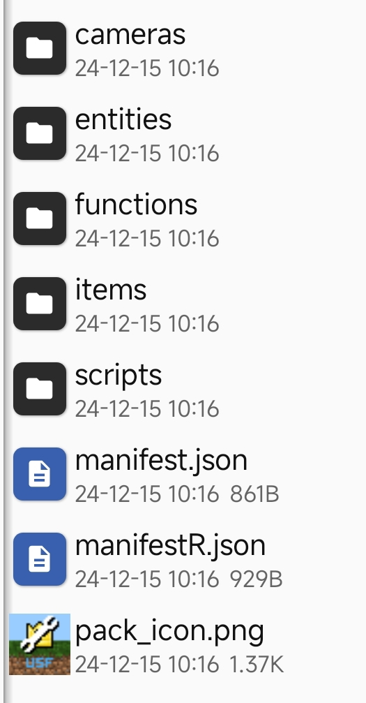
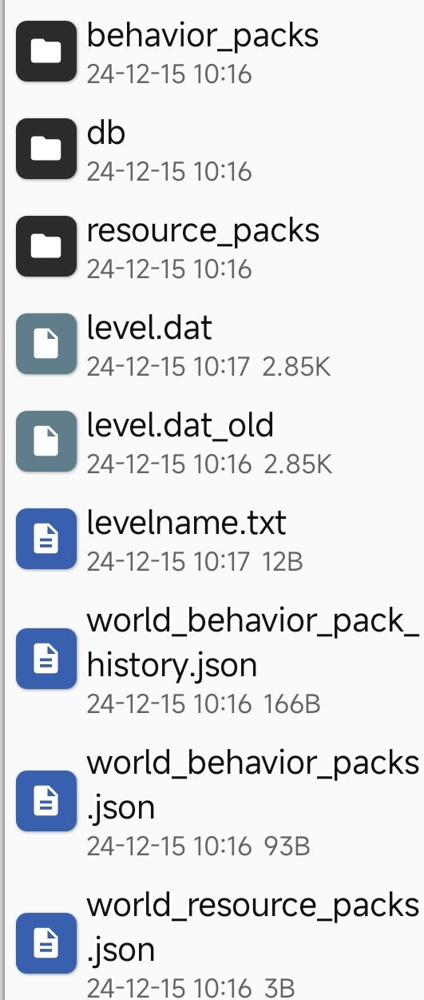

# 手动导入usf插件
**适用范围**
*1.服务器
*2面板服

#配置教程
*首先现在USF插件
*把下载的USF插件（mcpack）解压
*在服务器地图目录新建加behavior_packs文件夹然后在behavior_packs文件夹新建一个文件夹（名称随便）
*把下载解压好的USF目录下所以文件复制过去（目录文件如下如下）

*然后回到存档根目录在根目录下新建两个个文件
*文件名1：world_behavior_pack_history.json
*文件名2：world_behavior_packs.json

*然后把以下内容复制进去
> [!world_behavior_pack_history.json]
>{"packs":[{"can_be_redownloaded":false,"name":"服务器管理框架V2(基于GameTest框架)1.21+","uuid":"9472c503-5a92-43c8-7ddf-0492de2362d7","version":[1,0,0]}]}

> [!world_behavior_packs.json]
>[
	
	{
		"pack_id" : "9472c503-5a92-43c8-7ddf-0492de2362d7",
		"version" : [ 1, 0, 0 ]
	}
]

*把上面的信息复制进去就行了（理论上是这样未经过大量测试，有问题请反馈）